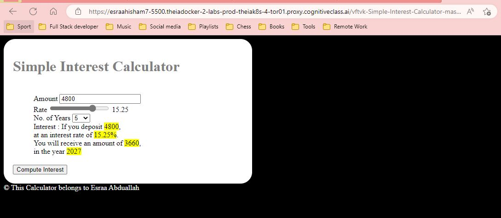

<a href="https://www.linkedin.com/in/esraa-abduallah-632117121/">
   
<a>
   
# github-final-project

A calculator that calculates simple interest given principal, annual rate of interest and time period in years.

Input:
   p, principal amount
   t, time period in years
   r, annual rate of interest
Output
   simple interest = p*t*r

## Table of content
- [Benefits of the project](#Benefits-of-the-project)

## Benefits of the project

People usually specially this year, 2022 want to make the largest revenue of their money. They always do lots of calculations to prove which place will give them the the largest amount of money to put their savings in. Using this interest calculator, you can get the result (the interest amount after the specified years in just one click.

## How to get started

Simply you can fork the code as your initial start . You can increase the number on inputs as needed by editing the [index.html file](./index.html), change colors of the app by editing the [style.css file](./style.css) and adding more functionalities by adding more functions to the [script.js file](./script.js).

## Usage

1. Clone the project
   ```sh
   $ git clone https://github.com/esraahisham753/github-final-project.git
   ```
2. You can open index.html file to test app
3. IF you input amount of 4800 USD, interest rate of 15.25% and 5 years period, you will receive result of 3660 USD.


You can watch a demo of the app on this [link](https://www.youtube.com/watch?v=k1sixtDKLXw)
   

## Roadmap

In future releases we can add a feature that user can divide his money among several places and see the revenue of different combinations and compare them to choose the best

## Support

For any help, you can contact me on my email: esraahisham753@gmail.com

## Who maintains and contributes to the project

This project is maintained by me, Esraa Abduallah

## Contributing

Pull requests are welcome. For major changes, please open an issue first
to discuss what you would like to change.
Contributions shoudn't have any types of errors to be accepted

Please make sure to update tests as appropriate.

## Authors and acknowledgment

The project is based on IBM "Getting started with git and github course".

## License

[Apache 2.0](http://www.apache.org/licenses/)

